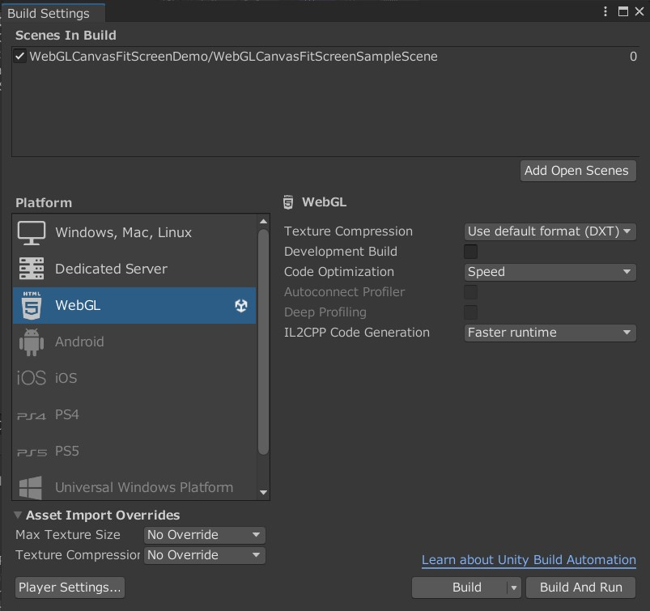
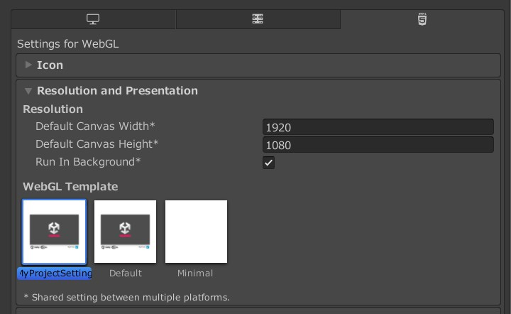

# UnityWebGLCanvasFitScreen

UnityのWebGLで画面のアスペクト比を固定しつつ、画面サイズをWebブラウザーの表示に合わせて変更するサンプルプロジェクトです。

DemoURL 
https://miyakovsky.github.io/UnityWebGLCanvasFitScreen/

# 導入方法
WebGLCanvasFitScreen\Assets\WebGLTemplates\MyProjectSettingフォルダを導入するプロジェクトに入れます。
WebGLCanvasFitScreen\Assets\WebGLTemplatesフォルダを導入するプロジェクトのAssetsにコピーするか、WebGLTemplatesがすでにある場合はMyProjectSettingフォルダのみをWebGLTemplatesへコピーすれば大丈夫です。

# 使用方法
- プロジェクト設定をWebGLにする

  
  
- Project SettingsでResolutinの解像度の設定をする
- WebGL TemplateをMyProjectSettingに変更する

  
  
- Build And Runを実行して、WebGLで出力して動作確認をする

